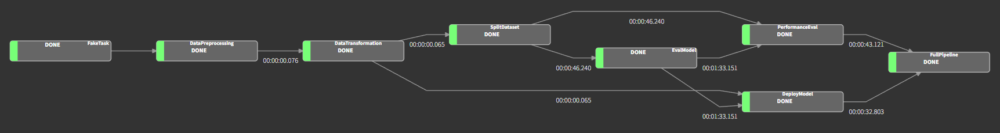

# xtream AI Challenge

## Ready Player 1? 🚀

Hey there! If you're reading this, you've already aced our first screening. Awesome job! 👏👏👏

Welcome to the next level of your journey towards the [xtream](https://xtreamers.io) AI squad. Here's your cool new assignment.

Take your time – you've got **10 days** to show us your magic, starting from when you get this. No rush, work at your pace. If you need more time, just let us know. We're here to help you succeed. 🤝

### What You Need to Do

Think of this as a real-world project. Fork this repo and treat it as if you're working on something big! When the deadline hits, we'll be excited to check out your work. No need to tell us you're done – we'll know. 😎

🚨 **Heads Up**: You might think the tasks are a bit open-ended or the instructions aren't super detailed. That’s intentional! We want to see how you creatively make the most out of the data and craft your own effective solutions.

🚨 **Remember**: At the end of this doc, there's a "How to run" section left blank just for you. Please fill it in with instructions on how to run your code.

### How We'll Evaluate Your Work

We'll be looking at a bunch of things to see how awesome your work is, like:

* Your approach and method
* Your understanding of the data
* The clarity and completeness of your findings
* How you use your tools (like git and Python packages)
* The neatness of your code
* The readability and maintainability of your code
* The clarity of your documentation

🚨 **Keep This in Mind**: This isn't about building the fanciest model: we're more interested in your process and thinking.

---

### Diamonds

**Problem type**: Regression

**Dataset description**: [Diamonds Readme](./datasets/diamonds/README.md)

Meet Don Francesco, the mystery-shrouded, fabulously wealthy owner of a jewelry empire. 

He's got an impressive collection of 5000 diamonds and a temperament to match - so let's keep him smiling, shall we? 
In our dataset, you'll find all the glittery details of these gems, from size to sparkle, along with their values 
appraised by an expert. You can assume that the expert's valuations are in line with the real market value of the stones.

#### Challenge 1

Plot twist! The expert who priced these gems has now vanished. 
Francesco needs you to be the new diamond evaluator. 
He's looking for a **model that predicts a gem's worth based on its characteristics**. 
And, because Francesco's clientele is as demanding as he is, he wants the why behind every price tag. 

Create a Jupyter notebook where you develop and evaluate your model.

#### Challenge 2

Good news! Francesco is impressed with the performance of your model. 
Now, he's ready to hire a new expert and expand his diamond database. 

**Develop an automated pipeline** that trains your model with fresh data, 
keeping it as sharp as the diamonds it assesses.

#### Challenge 3

Finally, Francesco wants to bring your brilliance to his business's fingertips. 

**Build a REST API** to integrate your model into a web app, 
making it a cinch for his team to use. 
Keep it developer-friendly – after all, not everyone speaks 'data scientist'!

#### Challenge 4

Your model is doing great, and Francesco wants to make even more money.

The next step is exposing the model to other businesses, but this calls for an upgrade in the training and serving infrastructure.
Using your favorite cloud provider, either AWS, GCP, or Azure, design cloud-based training and serving pipelines.
You should not implement the solution, but you should provide a **detailed explanation** of the architecture and the services you would use, motivating your choices.

So, ready to add some sparkle to this challenge? Let's make these diamonds shine! 🌟💎✨

---

## How to run

### Challenge 1

The Jupyter notebook used for the first challenge is `diamonds_notebook.ipynb`, which can be found inside the directory `challenge_1`.

The notebook was tested using two methods: on **Google Colab** or, locally, on **Anaconda**.

#### Execution on Google Colab

This is the simplest method: just import the notebook on Google Colab and the code blocks will take care of everything! In fact, the notebook was originally written using Google Colab and so it's the first tested method.

There is no need to import the dataset, just execute the first code block.

Since the library h2o is not installed by default on Google Colab, there is a pip command on the second code block to automatically manage the missing dependency.

Just enjoy the notebook on Google Colab!

#### Local execution on Anaconda

The notebook was also tested locally: that's why there's a requirements.txt file in the repository root. Assuming Anaconda is already installed, here are the instructions to execute the notebook properly:

 1. **Create the Conda environment** with
 `conda create --name xtream --file requirements.txt -c h2oai -c conda-forge`. 
 This command will create an environment called xtream and it will install all the dependencies listed in requirements.txt, using the channels h2oai (to retrieve the h2o library) and conda-forge.
 2. **Activate the xtream environment** with 
 `conda activate xtream`
 3. **Change the working directory to challenge_1** with 
 `cd challenge_1`
 4. **Start the jupyter notebook** with 
 `jupyter notebook diamonds_notebook.ipynb`

In this case, there is no need to execute the first code block, since the csv is already on the filesystem.

### Challenge 2

To cope with challenge 2, the solution includes a **Luigi pipeline**: the reason why Luigi was used is that **xtream** uses this library, as written [here](https://xtreamers.io/portfolio/power-forecasting).

The directory `challenge_2` contains three files:

 - luigi.cfg: a configuration file with the default output target paths used by Luigi tasks if no parameter is specified (and also the raw dataset path)
 - pipeline.py: it contains the full pipeline code for each task (refer to this documented source code for more details)
 - **start_pipeline.py**: this is the wrapper script which can be launched via command line to simplify the pipeline execution process.

Here is a dependency graph generated by Luigi, to show what the pipeline looks like:

As said before, the details can be found on the source code, but for the next challenge we should notice that the deployment model gets saved to file, by default `challenge_2/models/deploy_model`.

#### Execution via wrapper script (recommended)

To **execute all the pipeline tasks**, after activating the previously created Conda environment (and being in the root directory), run the following two commands:

 1. `cd challenge_2`
 2. `python start_pipeline.py`

This is the easiest and recommended way because the wrapper script automatically manages the h2o cluster creation and shutdown.

The paths (used by the tasks) can be customized by editing the configuration file `luigi.cfg`.

**Alternative method**

The first step (changing the working directory in the Conda environment) is the same, but instead of exploiting the wrapper script, the alternative method consists in doing a few extra steps:

 1. **Initialize a h2o cluster**, for instance using `h2o.init()` in a Python script
 2. **Choose which Luigi task** to run. The wrapper script runs FullPipeline (which is a WrapperTask that requires the two independent tasks DeployModel and PerformanceEval), but any single task can be executed manually
 3. **Execute the task**, e.g. using 

	> python -m luigi --module pipeline DataPreprocessing --cleaned-csv
	> "../datasets/diamonds/example_custom_path.csv"

	By executing a task manually we can customize the parameters directly via command line, without changing the configuration file. A parameter specified in this way has the priority over `luigi.cfg`. 
	If there is no need to monitor the pipeline, for development purposes `--local-scheduler` should be specified in the command. Obviously, for production usage a centralized scheduler must be used.
4. **Shut down the h2o cluster** to avoid wasting resources, if not used anymore. 
In this case it has to be done manually, e.g. with `h2o.cluster().shutdown()`. 

Enjoy the plumbing with *Luigi*!